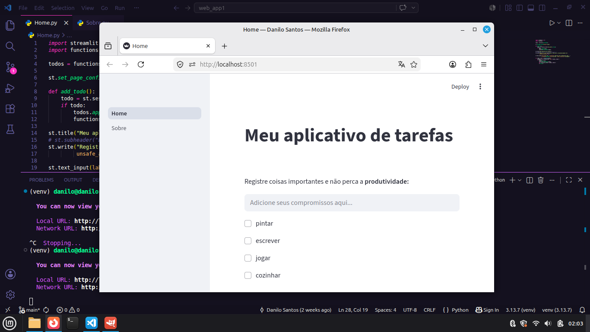

# 📝 Todolist WebApp em Python (Streamlit)


Uma aplicação funcional de lista de tarefas (**To-Do List**) desenvolvida em **Python**, utilizando **Streamlit** como base principal. O usuário insere uma tarefa em um campo de texto e ela é imediatamente adicionada à lista exibida na tela. Além disso, todas as tarefas são salvas automaticamente em um arquivo de texto externo que acompanha o aplicativo, garantindo persistência dos dados.

---

## 📷 Preview

<p align="center">
  
</p>

---

## 🚀 Demonstração Online

🔗 [Acesse o app hospedado no Streamlit](https://todolist-webapp-danilosantosdev.streamlit.app//)

---

## 🧩 Estrutura do Projeto

```text
📂 todolist-webapp/  
│  
├── 📄 Home.py — Código principal da interface Streamlit  
├── 📄 functions.py — Funções responsáveis por adicionar, salvar e gerenciar tarefas  
├── 📄 todos.txt — Arquivo de texto onde as tarefas são armazenadas  
├── 📄 requirements.txt — Dependências Python do projeto
├── 📄 preview.png — Imagem do app aberto
├── 📄 README.md — Documentação do projeto
├── 📄 LICENSE — Licença MIT
│  
└── 📂 pages/  
　　└── 📄 Sobre.py — Página adicional "Sobre" do aplicativo  
```

---

## ⚙️ Funcionalidades

✅ Adicionar novas tarefas via campo de texto interativo  
✅ Exibir todas as tarefas atuais na tela    
✅ Interface simples, moderna e responsiva utilizando Streamlit  
✅ Página “Sobre” com informações de uso

---

## 🖥️ Como Executar o Projeto

**1️⃣ Instalar as dependências**  
No terminal do editor, execute:  
```bash
pip install -r requirements.txt
```

**2️⃣ Executar o aplicativo principal**  
No terminal, insira o comando:  
```bash
python -m streamlit run Home.py
```

Um link será gerado no terminal. Clique nele (ou copie e cole no navegador) para abrir a interface Streamlit do aplicativo.

---

## 🧠 Tecnologias Utilizadas

- **Python 3.13**  
- **Streamlit**  
- **Manipulação de dados**

---

## 📄 Licença

Distribuído sob a **Licença MIT**.

Este projeto é open source e pode ser utilizado livremente para fins educacionais e de aprendizado.

---

## 👨‍💻 Autor

**Danilo Santos**  
🐙 GitHub: https://github.com/danilo-santos-python  
🌐 Repositório: https://github.com/danilo-santos-python/todolist-webapp

---

⭐ Se este projeto foi útil para você, considere deixar uma estrela no repositório!
